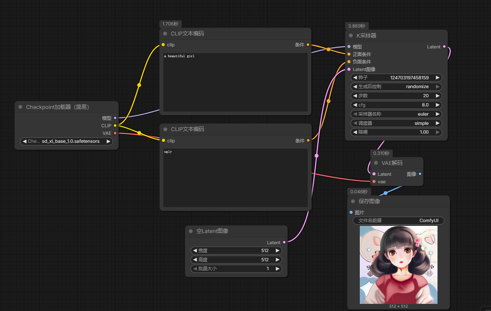

# ComfyUI  
方便易用的AI图像生成工具，使用工作流的方式来构建图像生成过程。

## 软件下载
进入官网进行下载，也可以在B站搜索相关视频进行整合包的下载

## 基本使用方法
点开一个工作流文件，根据提升安装相应的模型文件和插件文件，值得一提的是，其中模型文件大多在huggingface上，故开梯子又慢又费流量，因此推荐镜像站下载，而且推荐使用迅雷下载，速度很快很舒服

## 细致学习

| 节点类型              | 功能        |
| ----------------- | --------- |
| Checkpoint Loader | 读取模型      |
| CLIP Text Encode  | 解析 prompt |
| KSampler          | 生成图片      |
| VAE Decode        | 输出图片      |

### 核心节点
1. load checkpoint：加载模型文件，通常是ckpt或者safetensors格式的文件
2. CLIP Text Encode：解析 prompt，生成文本特征向量,有 positive 和 negative 两种输入，分别对应正向提示词和反向提示词
3. KSampler：生成图片，输入文本特征向量和随机噪声，输出潜在空间中的图像特征向量
4. empty latent image：生成随机噪声，输入一个随机种子，输出潜在空间中的随机噪声
5. vae decode：输出图片，输入潜在空间中的图像特征向量，输出最终的图像
6. save image：保存图片，输入最终的图像，输出保存的图片文件
7. preview image：预览图片，输入最终的图像，输出预览的图片

### 入门搭建（文生图）

使用模型：
sd_xl_base
他是为1024*1024分辨率训练的模型

ksampler：
步数：生成图片的迭代次数，通常设置在20-50之间，步数越多，生成的图片质量越高，但也会增加生成时间

cfg scale：控制生成图片与提示词的匹配程度，数值越大，生成的图片越符合提示词，但也可能导致过拟合，通常设置在7-15之间

prompt:
控制构图 + 光影 + 镜头语言。

### 进阶使用
Hires

构图->放大->细节修复

lora 使用
lora: 强化 1.模型理解能力 2.文本理解能力 

### 入门搭建（图生图）
已有图片+噪声->潜在空间中的图像特征向量->输出图片

使用vae encoder 节点将输入图片编码为潜在空间中的图像特征向量，然后将其与随机噪声结合，输入到ksampler节点中进行图像生成，最后使用vae decode节点输出最终的图像。

Ksampler中的步数和cfg scale的设置与文生图相同，通常设置在20-50之间，cfg scale设置在7-15之间。但是denoise strength的设置需要根据输入图片的质量和期望的输出效果进行调整，通常设置在0.2-0.5之间，数值越大，生成的图片与输入图片的差异越大，但也可能导致过度修改输入图片。

### 进阶
局部重绘
使用mask editor 来编辑图像

### 入门搭建（视频生成）
animatediff loader:在原来的模型上加上motion 模块，能够生成视频

latent图像batch处理：一次生成多张图像，输入一个batch size，输出一个包含多张图像的列表

video combiner:将生成的图像序列合成为视频，输入一个包含多张图像的列表，输出一个视频文件

controlnet:增强模型的控制能力，输入一个控制信号，输出一个调整后的图像特征向量