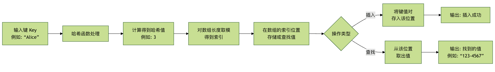

# 哈希表

## 介绍
哈希表（Hash Map）是一种用于存储键值对的数据结构，允许通过键快速访问对应的值。它通过哈希函数将键映射到数组中的一个索引位置，从而实现高效的数据存取。


## 基本操作（C++实现）

1. 初始化
```cpp
unordered_map<int, int> hash_table; 
```
2. 插入元素
```cpp 
hash_table[key] = value; 
```

3. 查找元素
```cpp
auto it = hash_table.find(key);
if (it != hash_table.end()) {
    // 元素存在，it->second 是对应的值
} else {
    // 元素不存在
}
```
4. 删除元素
```cpp
hash_table.erase(key);
```
5. 遍历哈希表
```cpp
for (const auto& pair : hash_table) {
    int key = pair.first;
    int value = pair.second;
    // 处理 key 和 value
}
```
## 示例代码：两数之和
选用值作为键，索引作为值进行存储（因为我们查的是target-当前值是否存在）
```cpp
class Solution {
public:
    vector<int> twoSum(vector<int>& nums, int target) {
        unordered_map<int, int> hash_table;
        int i;
        for (i = 0; i< nums.size();i++){
            auto it = hash_table.find(target-nums[i]);
            if  (it != hash_table.end()){
                return {i,hash_table[i]};
            }
            hash_table[nums[i]] = i; //关键 存储键值对
        }

        return {};
    }
};
```