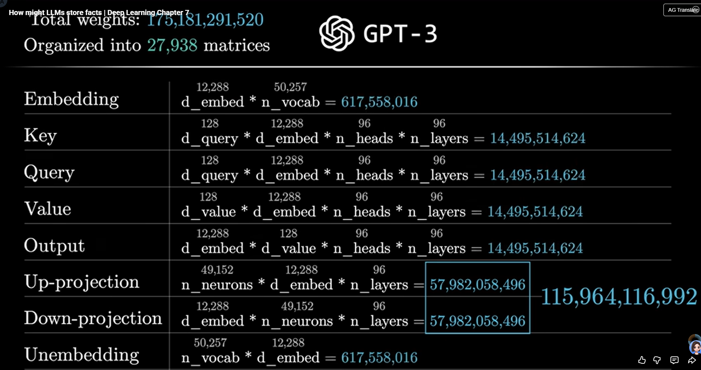

# GPT (Generative Pre-trained Transformer) 

## What does "Transformer" Do ?
transformer最初是用来机器翻译的模型，但是后面发现很nb，就被广泛应用在各种NLP任务中，比如文本生成、文本分类、情感分析等。
核心目标：通过之前的内容预测下一个词是什么
->再自回归即可生成长段内容

## How does Transformer Work ?
顺着信息流的方向来看，Transformer主要包括以下几个步骤：
### Sentence-> Token-> Embedding
把一句话拆成一个个的token（词元），每个token会被映射成一个向量（embedding）。
对于LLM
token可以是一个词，一个字符，甚至是一个子词（subword）。

token会把句子中的每个词转换成一个数字ID，然后通过查表的方式把ID映射成一个向量（embedding）。

使用一个高维向量来表示每个token的语义信息，相近的token会被映射到相近的向量空间中。

举例：(简化描述为空格拆分)

句子："The cat sits on the mat."

    |
    |
Tokens: ["The", "cat", "sits", "on", "the", "mat", "."]

    |
    |

Embeddings:
[ [0.1, 0.3, ...], [0.4, 0.2, ...], [0.5, 0.6, ...], ... ]

Embedding性质：
相似的词语会有相似的向量表示，比如 "cat" 和 "dog" 的向量距离会比较近。
E("king") - E("queen") ≈ E("man") - E("woman")

context size:2048(GPT3)
12288(维度)*2048(max length)
Embedding matrix:将词表映射到向量空间(词表大小  12288* 50257)
Wu(Unembedding matrix):将向量映射回词表概率分布(词表大小 50257* 12288)

Softmax:将向量映射回词表概率分布
    P(wi)=exp(E(wi)·h/T)/Σj exp(E(wj)·h/T)
Temperature:控制生成文本的随机性
T越大，生成的文本越随机 大的占的没那么大；T越小，生成的文本越确定 大的占比很大。

Logits:未归一化的概率分布
    logits=E(wi)·h/T

### Self-Attention Mechanism(让每一个向量吸收全局信息和语义)
固定的Embedding无法表达一个token在不同上下文中的不同含义。
如：
"The bank is by the river." vs "I need to go to the bank to deposit money."

Transformer引入了Self-Attention机制来捕捉词与词之间的关系，帮助Embedding动态调整表示。
Self-Attention的核心思想是：对于输入序列中的每个token，计算它与序列中所有其他token的相关性（注意力分数），然后根据这些分数加权求和，得到一个新的表示。

Query 矩阵：128*12288(可以看做提问者)
for every token:
    Wq() * Ei = Qi

Key 矩阵：128*12288dimension(可以看做回答者)
for every token:
    Wk() * Ei = Ki

衡量相关性：
Qi · Kj -> 越大说明越相关，越小说明不相关
为方便使用-->除以sqrt(dk) (dk是Key的维度),再使用Softmax归一化

Attention Score:
    Attention(Qi, K) = softmax(Qi · K^T / sqrt(dk))

后方的词不影响前方的词-->masking 
    before softmax 设置为-inf

Value 矩阵：12288*12288?(将相关信息给提取出来给Embedding做调整)
矩阵分解->12288*128 128*12288

Multi-Head Attention:
将Self-Attention机制并行化，使用多个注意力头（head）来捕捉不同的语义关系。
96个head，每个head有自己的一套Wq,Wk,Wv矩阵。
每个head独立计算Attention，然后将所有head的输出拼接起来。

### MLP (Feed-Forward Neural Network)
每个Transformer层中，除了Self-Attention机制外，还有一个前馈神经网络(MLP)。
可以认为是存储知识等信息 

对于每一个token对应的embedding,Linear变换->R(G)ELU激活->Linear变换
    FFN(x) = max(0, xW1 + b1)W2 + b2
Wup(4*12288)*12288 bias(4*12288)
Wdown(12288*4) bias(12288)

得到的结果再加上原来的embedding

